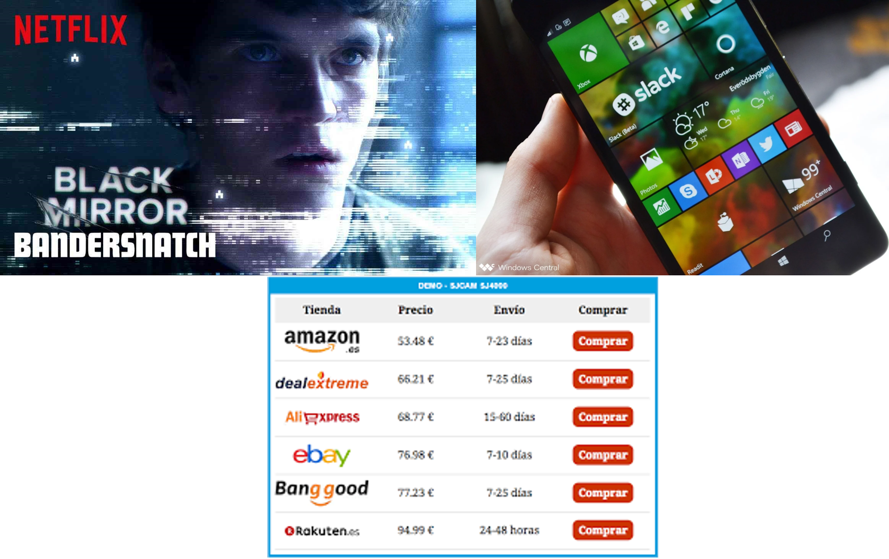

---

class: center, middle, remark-inverse

# 1. Introducción a los sistemas de información

---
class: middle, center

# 1. ¿Qué es un sistema de información?

.pull-left[ 

</img>]

.pull-right[

## <b>Gestión</b> de <b>información</b> con <b>tecnología y procesos</b>

]


---

# 1.1. Información es
  
.pull-left[

<blockquote> <i class="fas fa-quote-left accent"></i> conjunto de datos organizados en un <b>mensaje</b> que añade <b>conocimiento</b> al receptor</blockquote>

<blockquote> <i class="fas fa-quote-left accent"></i> Información <b>digital</b>: aquella que puede ser codificado en un conjunto de bits.</blockquote>

e.g. Libros, bases de datos, imágenes, películas, música, precios, espacios publicitarios...
    ]

.pull-right[

</img>
]

### Información para la toma de decisiones en las organizaciones

---
class: middle,center 

# Datos vs Información: 

### - **Datos**: flujos de elementos en bruto, eventos
### - **Información**: datos transformados en elementos significativos y útiles

```{r echo=FALSE, message=FALSE, warning=FALSE, out.width="90%"}

knitr::include_graphics("images/fig01_03.jpg")

```
---

# 1.2. Características de la información (I)

- Costosa de **producir** pero fácil de **reproducir**: altos costes fijos, bajos costes marginales

| Rank                                                         |                     Title                     | Year |                    Cost (est.) (millions)                    |
| :----------------------------------------------------------- | :-------------------------------------------: | :--: | :----------------------------------------------------------: |
| 1                                                            | *Pirates of the Caribbean: On Stranger Tides* | 2011 |                             $422                             |
| 2                                                            |           *Avengers: Age of Ultron*           | 2015 |                             $386                             |
| 3                                                            |  *Pirates of the Caribbean: At World's End*   | 2007 |                             $362                             |
| 4                                                            |              *Avengers: Endgame*              | 2019 |                             $356                             |
| 5                                                            |           *Avengers: Infinity War*            | 2018 |                             $316                             |
| 6                                                            |                   *Titanic*                   | 1997 |                             $312                             |

[Fuente: Wikipedia](https://en.wikipedia.org/wiki/List_of_most_expensive_films)

---
class: center
# Características de la información (II)


- Fácil de copiar y difícil de proteger: gestión de la **propiedad intelectual**


</img>

<a href="https://www.xataka.com/otros/google-drive-comodo-que-se-ha-convertido-para-muchos-alternativa-ideal-a-paginas-descargas" target="_blank">Google Drive para descargas</a>


---
# Características de la información (III)

- Bienes de **experiencia**: Valoración tras el disfrute

<a href="https://www.ibisworld.com/cart/purchase-options/" target="_blank">
  <button class="btn">
    <span class="button--inner">Ejemplo: Ibis Reports</span>
  </button>
</a>
<div class="centerdiv">
</img>
</div>

---
# Características de la información (III)

- Rápida distribución en el tiempo y el espacio: **Sobrecarga de información** 

<div class="centerdiv">

</img>
</div>

---
class:center, middle

## ¿Cómo localizar, filtrar y comunicar lo relevante?

 
.pull-left[
<p></p><br>
<p></p><br>
<iframe src="https://giphy.com/embed/3o6gDSdED1B5wjC2Gc" width="380" height="278" frameBorder="0" class="giphy-embed" allowFullScreen></iframe>]

.pull-right[
<p></p><br>
<p></p><br>
</img>]

-
---
# 1.3. Tecnología de información es 

- La TI ha traído enormes incrementos en la capacidad para gestionar la información haciéndola más valiosa.

.left-column[    
</img>
]
.right-column[

> ### <i class="fa fa-quote-left accent"></i>... la infraestructura que hace posible almacenar, buscar, acceder, copiar, filtrar, manipular, transmitir y recibir información</blockquote>

]

---
# Tecnología de información y contenido 

.pull-left[

### La creación de valor es bidireccional

### El contenido no puede operar sin infraestructura y viceversa]

.pull-right[

 </img>
 ]
---
# 1.4. Definición y componentes en un sistema de información

### - ¿Hacen falta ordenadores?
### - ¿Hacen falta datos?
### - ¿Hacen falta personas?

<a href="https://b.socrative.com/teacher/#start-quiz/24569842" target="_blank">
  <button class="btn">
    <span class="button--inner">Socrative. Room 282228</span>
  </button>
</a>

---
class: middle

# Definición: 

> ### <i class="fa fa-quote-left accent"></i> Un sistema de información es el conjunto de componentes <b>interrelacionados</b> que recolectan (o recuperan), procesan, almacenan y distribuyen <b>información</b> para apoyar los procesos de <b>toma de decisiones y de control</b> en una <b>organización</b>

- Objetivos  
- Contexto  
- Componentes: personas, actividades, datos, recursos materiales  
---
class: center

# Representación gráfica

```{r echo=FALSE,  message=FALSE, warning=FALSE, out.width="95%"}


```

*Adaptado de Laudon y Laudon (2018)*

---

# Actividades en un Sistema de Información: 

- **Input**: Captura de datos de la organización o el entorno  

- **Procesamiento**: Implantan programas y planes procesos 


- **Output**: Transferencia de la información a las actividades o personas necesarias  

- Además, el **feedback**: es la información que se devuelve para evaluar y refinar la entrada  

---

# Los SI son instrumentos de **creación de valor**

- Las inversiones en tecnología deben proporcionar <i class="fa fa-caret-up accent"></i> productividad, <i class="fa fa-caret-up accent"></i>  ingresos, <i class="fa fa-caret-up accent"></i> posición estratégica ... 

- Las inversiones en tecnología se evalúan en **una determinada organización** con su estructura, características y procesos.

- Los datos en bruto adquiridos y transformados a través de etapas generan **información de valor** 

-  El **valor** del SI se determina por el grado en que se alcanzan **mejores decisiones, una mayor eficiencia y mayores beneficios**