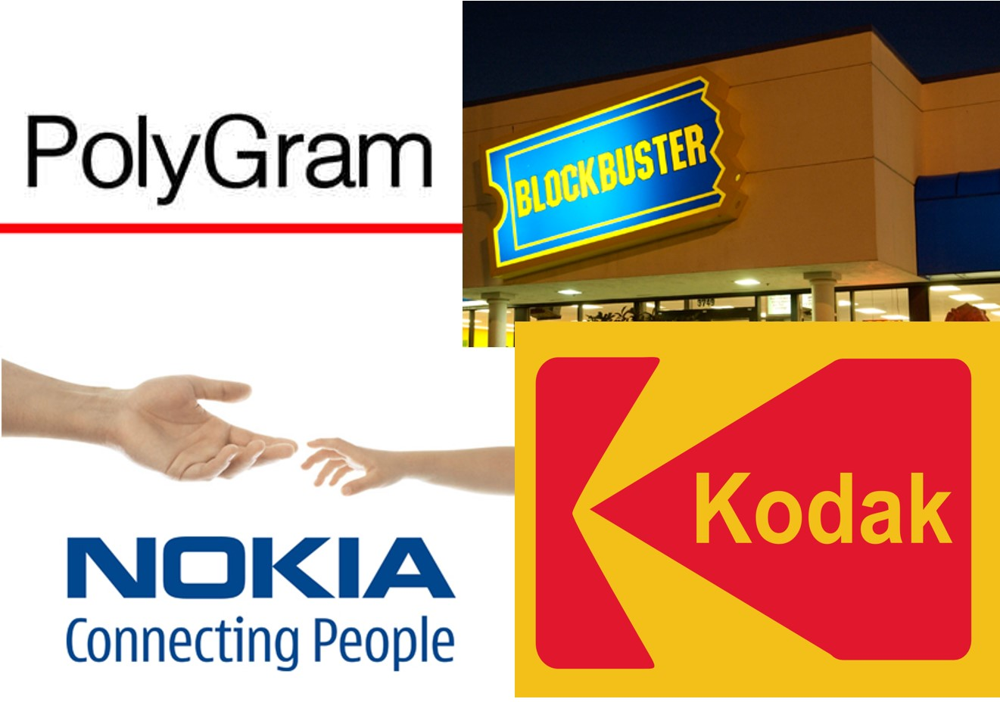

class: center, middle, remark-inverse

# 2. Los sistemas de información en los negocios

---


# 2.1. El impacto de las TI en la sociedad

<div style="font-size:0.9em">

<table class="tablabase">
<tr>
<th width="34%">Negocios</th>
<th width="33%">Tecnología</th>
<th width="33%">Sociedad</th>
</tr>

<tr>
<td valign="top">
<ul>

<li>Online retailing ↑ 20%</li>
<li>Mobile retailing ↑80.000M€ EU5*</li>
<li>Apps móviles 2000M usuarios</li>
<li>Comercio en RRSS ↑ 25.000M€ 2016</li>
<li>Plataformas de "servicio a demanda"</li>
<li>Publicidad móvil: 70% publicidad digital</li>
<li>Pequeños negocios: plataformas de comercio</li>

</ul>

</td>
<td  valign="top">

<ul>

<li>Capacidades móviles</li>
<li>Computación en la nube</li>
<li>Internet of Things</li>
<li>Big Data</li>
<li>Business Analytics</li>

</ul>

</td>

<td  valign="top">

<ul>

<li>Contenidos generados por los usuarios</li>
<li>Amenazas a la privacidad</li>
<li>Adultos en redes sociales</li>
<li>Conflictos de copyright</li>
<li>Aspectos tributarios</li>
<li>Seguridad de la red</li>
<li>Empleo precario</li>

</ul>

</td>

</tr>
</table>

</div>

<span style="font-size:0.7em"><i>Fuente: Laudon y Guercier (2018)</i><span>
.footnote[<span style="font-size:0.7em">* Francia, Alemania, Italia, España, Reino Unido</span>]

---
class: center

# 2.2. El impacto de las TI en la empresa


```{r echo=FALSE, message=FALSE, warning=FALSE, out.width="80%"}


```

---
# Los sistemas de información y los objetivos de la empresa


<table class="tablabase">
    <tr>
    <td>(a) Excelencia Operacional</td>
  </tr>
  <tr>
    <td>(b) Nuevos productos,servicios y modelos de negocio</td>
  </tr>
  <tr>
    <td>(c) Cercanía / compromiso con clientes y proveedores</td>
  </tr>
  <tr>
    <td>(d) Mejora en la toma de decisiones</td>
  </tr>
  <tr>
    <td>(e) Ventaja competitiva</td>
  </tr>
  <tr>
    <td>(f) Supervivencia</td>
  </tr>
</table>
---

# (a) Excelencia Operacional

> ### Mejora de la eficiencia de sus operaciones para alcanzar una mayor rentabilidad

.pull-left[**Impacto del SI**: Herramienta de mejora de eficiencia y productividad

Ejemplo: <a href="https://www.inditex.com/es/un-modelo-sostenible/como-trabajamos/logistica" target="_blank">Logística en Inditex</a>

Ejemplo: [Walmart Retail Link](http://www.gcretailconsultores.com.mx/blog/que-es-retail-link/)]

.pull-right[
```{r echo=FALSE, message=FALSE, warning=FALSE, out.width="100%"}

knitr::include_graphics("images/walmart.png")

```
]

---

# (b) Nuevos productos,servicios y modelos de negocio

> ### Modelos de negocio: la forma en que una empresa produce, entrega y vende un producto o servicio para crear riqueza

.pull-left[**Impacto del SI**: Generan productos y servicios así como modelos de negocio totalmente nuevos  

e.g. [Clothes renting](https://www.renttherunway.com/)
]


.pull-right[

e.g. [Aranzadi Infolex](https://www.infolexnube.es/Account/Login?ReturnUrl=%2f)

<iframe width="1800" height="155" src="https://www.youtube.com/embed/xEak6SDzc3A" frameborder="0" allow="accelerometer; autoplay; encrypted-media; gyroscope; picture-in-picture" allowfullscreen></iframe>

<a href="https://www.youtube.com/watch?v=xEak6SDzc3A" target="_blank">
  <button class="btn">
    <span class="buttoninner">Ver en Youtube</span>
  </button>
</a>
]

---

# (c) Cercanía y compromiso con clientes y proveedores

> ### CRM: Customer Relationship Management

.pull-left[**Impacto del SI**: Requisito para poder implantar cualquier programa CRM. Sin un SI no podemos conocer, ni almacenar las interacciones con el cliente y no podemos personalizar la oferta.]

.pull-right[

```{r echo=FALSE, fig.margin=TRUE, message=FALSE, warning=FALSE, out.width="95%"}


```

]

---

# (d) Mejora en la toma de decisiones

> ### Ante posibles situaciones de falta de información como sobreproducción o subproducción, mala asignación de los recursos, tiempos de respuesta deficientes, mayores costes...

.pull-left[
El Corte Inglés y SAP:

[Video](https://www.youtube.com/embed/UnpZt6fcD5o)

- ¿Qué es una solución estandarizada?  
- ¿Cuál es el foco de la actividad de El Corte Inglés?  
- ¿Cuáles son los retos futuros en retaling?  ]

.pull-right[

Otros ejemplos de soporte a la toma de decisiones

- [eye tracking](https://imotions.com/eye-tracking/), [EGG](https://neurolabcenter.com/egg) y otras técnicas de neuromarketing
- [Inteligencia Artificial](https://www.puromarketing.com/12/31463/como-inteligencia-artificial-podria-cambiar-completo-sector-retail.html) y [Big Data](https://www.bbvaopenmind.com/articulos/los-big-data-y-el-futuro-de-los-negocios/)
]

---
class: center

# (e) Ventaja Competitiva

.pull-left[

> ### Capacidad de la empresa para ser superior a la competencia de manera única y sostenible en el tiempo

Ejemplo: [Informe Interbrand: mejores marcas globales 2008 vs 2018](https://www.interbrand.com/best-brands/best-global-brands/2018/ranking/)

]

.pull-right[

<a href="images/globalbrands.png" target="_blank" width="100%" alt="ranking mejores marcas globales"></a>


]
---
class: center

# (f) Supervivencia

> ### Adaptación tecnológica para poder sobrevivir

Un buen SI no es una opción, es una necesidad: adaptación a nuevas realidades.


```{r echo=FALSE, message=FALSE, warning=FALSE, out.width="50%"}



```

