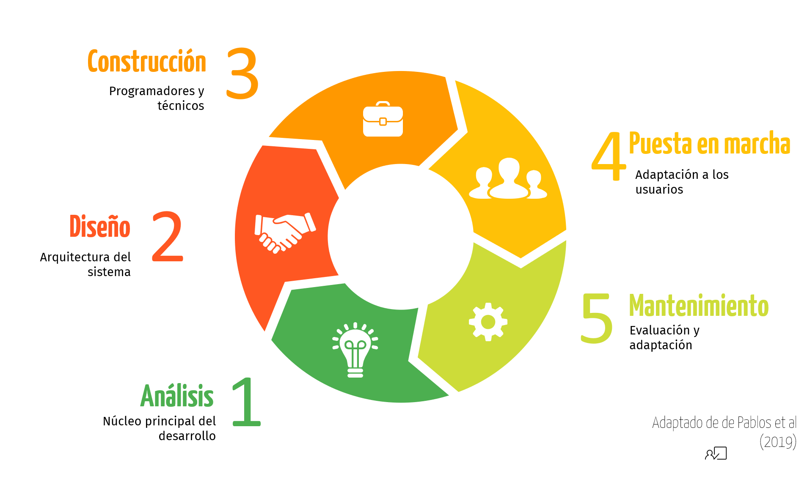

class: center, middle, remark-inverse

# 4. Diseño e implantación de sistemas de información

---

# Participantes en el proceso de desarrollo de sistemas

### <i class="fas fa-portrait accent"></i> Directivos

### <i class="fas fa-user-cog accent"></i> Directivos especialistas

### <i class="fa fa-user-tie accent"></i> Consultores

### <i class="fa fa-user-md accent" ></i> Personal técnico y de desarrollo

###  <i class="fa fa-user accent"></i> Usuarios finales

---

# Proceso de desarrollo

```{r echo=FALSE, message=FALSE, warning=FALSE, out.width="100%"}



```

---

# Metodologías para el desarrollo de sistemas de información

.pull-left[- Enfoque clásico: secuencial, por etapas del ciclo de vida

- Enfoque basado en **prototipos**: e.g. [programa Apolo](https://es.wikipedia.org/wiki/Programa_Apolo)

- Metodologías **Agile**: [Manifiesto](https://agilemanifesto.org/iso/es/manifesto.html), SCRUM, Kanban, Design Thinking
]

.pull-right[

<iframe width="500" height="300" src="https://www.youtube.com/embed/a33xOe9d_Dk" frameborder="0" allow="accelerometer; autoplay; encrypted-media; gyroscope; picture-in-picture" allowfullscreen></iframe>

<a href="https://www.youtube.com/watch?v=a33xOe9d_Dk" target="_blank">
  <button class="btn">
    <span class="buttoninner">Ver en Youtube</span>
  </button>
</a>
]

---
# Resumen

<a href="https://b.socrative.com/teacher/" target="_blank">
  <button class="btn btn-final">
    <span class="buttoninner"><i class="fas fa-question-circle"></i> Test en Socrative</a> </span>
  </button>
</a>


https://www.mindomo.com/mindmap/289e6e09459546d1a1dbecf1308cf9bb


### <span class="rojito">1.-</span> ¿Qué es un Sistema de Información?
### <span class="rojito">2.-</span> El papel de los SI en los negocios
### <span class="rojito">3.-</span> Tipos de sistemas de información
### <span class="rojito">4.-</span> Diseño e implementación de sistemas de información
