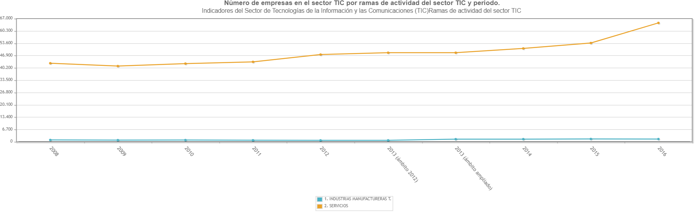
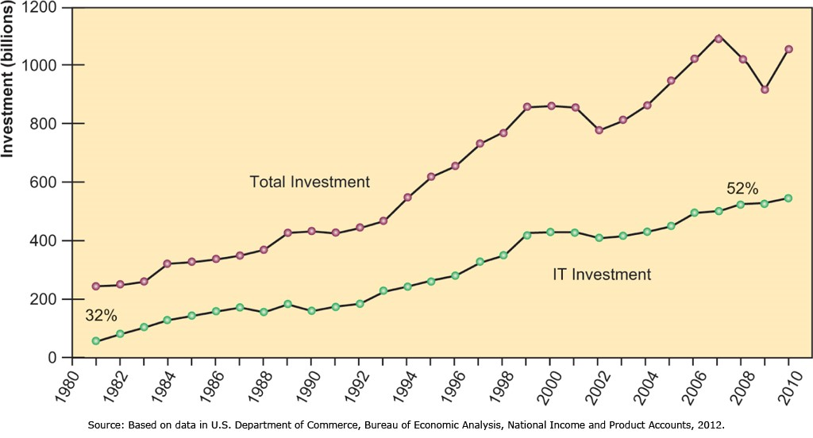
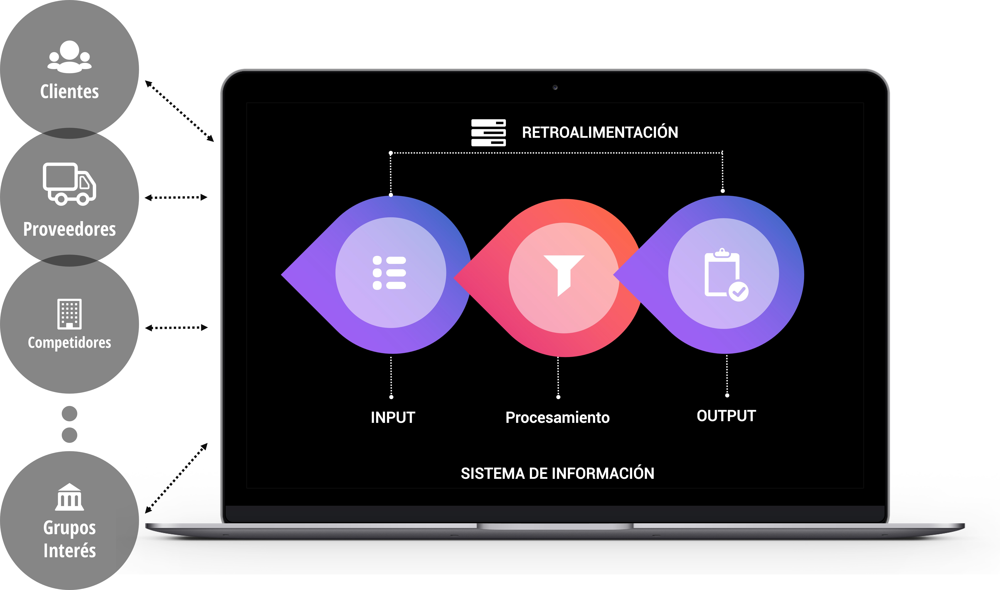

```{r setup, include=FALSE}
library(tint)
# invalidate cache when the package version changes
knitr::opts_chunk$set(tidy = FALSE, cache.extra = packageVersion('tint'))
options(htmltools.dir.version = FALSE)
```

```{r echo=FALSE, fig.margin=TRUE, message=FALSE, warning=FALSE, out.width="70px"}


```

# Secciones

- Objetivos de aprendizaje
1. ¿Qué es un Sistema de Información?
2. El papel de los SI en los negocios
3. Los SI: perspectiva tecnológica y de negocios
4. Metodología en el análisis de los sistemas de información

```{r echo=FALSE, fig.margin=TRUE, message=FALSE, warning=FALSE, out.width="100%"}

knitr::include_graphics("images/sinfo.jpg")

```

# Objetivos de aprendizaje

- Comprender los efectos de los Sistemas de Información en las empresas y su relación con la globalización 
- Explicar por qué los Sistemas de Información son tan esenciales para los negocios hoy en día 
- Definir un Sistema de Información y describir su gestión, organización y componentes de tecnología

# ¿Qué es un Sistema de Información?

Los sistemas de información están íntimamente relacionados con la gestión de la información necesaria para la actividad empresarial. La información disponible es muy abundante, por lo que el reto suele ser tratarla y aprovecharla.

```{r echo=FALSE, fig.margin=TRUE, message=FALSE, warning=FALSE, out.width="100%"}

knitr::include_graphics("images/sinfo2.png")

```

# 1. ¿Cómo definimos un sistema de información?

> *Conjunto de componentes interrelacionados que recolectan (o recuperan), procesan, almacenan y distribuyen información para apoyar los procesos de toma de decisiones y de control en una organización*

Lo que es importante a la hora de entender un sistema de información es no confundir los medios con el sistema en sí. Un sistema de información no es un sistema informático. La informática forma parte de él, pero no lo es todo. 

## Información

En primer lugar, con respecto a la información, se entiende por información todo aquello que es posible codificar en un conjunto de bits. Así, una fotografía de un cuadro es un bien de información mientras que el cuadro en sí es un bien físico.

```{r echo=FALSE, fig.margin=TRUE, message=FALSE, warning=FALSE, out.width="100%"}

knitr::include_graphics("images/gioconda.jpg")

```

Existen infinitos ejemplos de bienes de información, algunos (como un libro o un periódico) no necesariamente de información digital. Algunos de estos ejemplos son los libros, bases de datos, imágenes, películas, música, precios, espacios publicitarios...

## Características de la información

Así, la información es **costosa de producir pero fácil de reproducir**. Por ejemplo, una película o un videojuego tienen costes de producción de millones de euros, pero pueden reproducirse por céntimos. Dicho de otra forma, los bienes de información tienen altos costes fijos de producción y bajos costes marginales.

El hecho de que el coste marginal de producción sea bajo implica que son bienes **fáciles de copiar y difíciles de proteger** por lo que los aspectos ligados a la gestión de la propiedad intelectual son una preocupación permanente en las industrias digitales. 

Además, los bienes de información son **bienes de experiencia**, ya que el consumidor no es puede estar seguro de si el valor del bien se corresponde a su precio hasta después de su disfrute (por ejemplo, en el caso de un informe de inteligencia de mercado o una película).

Por último, la información se puede **distribuir muy rápidamente en el tiempo y en el espacio** por lo que crece en tamaño y en presencia y puede resultar en **sobrecarga de información** tanto para la toma de decisiones en las empresas como desde el punto de vista del consumidor. Así, resulta crítico facilitar los procesos por los que los consumidores localizan y filtran la información para comunicar lo relevante.

```{r echo=FALSE, fig.margin=TRUE, message=FALSE, warning=FALSE, out.width="100%"}


```

Hay estudios que indican que recibimos cada segundo información equivalente a 11.000.000 de bits (datos codificados en binario 0/1). Esto provoca una sobrecarga cognitiva al recibir mucha más información de la que somos capaces de procesar. 

## Tecnologías de la información

La tecnología de la información se define como la infraestructura que hace posible **almacenar, buscar, acceder, copiar, filtrar, manipular, transmitir y recibir información**.

La evolución en la tecnología de la información ha facilitado enormemente las capacidades para la gestión de esta información, **aumentando simultáneamente su valor**.

Así, la información es más valiosa si podemos acceder a ella en el momento en el que la necesitamos que si tenemos que esperar semanas. Por ejemplo, el valor de la información sobre los precios de un producto en distintos establecimientos se ha incrementado enormemente para los consumidores cuando pueden acceder a ella de forma inmediata en el móvil mientras están tomando la decisión de compra.

Así, los creadores de contenido digital dependen de las capacidades de la infraestructura y los operadores de infraestructura dependen de los creadores de contenido. Por ejemplo, una plataforma de hardware para la que no se desarrolla software no tiene futuro (e.g. Windows Mobile).

## Breve historia de la IT

Para entenderlo mejor, estaría bien saber cómo hemos llegado aquí… Así, repasamos brevemente la historia de la tecnología de la información [Breve historia de la IT](https://www.youtube.com/watch?v=pYjyqYi2J9I) (3,55’’).

```{r echo=FALSE, fig.margin=TRUE, message=FALSE, warning=FALSE, out.width="100%"}


```

La Tecnología de la Información surge cuando se producen los primeros intercambios de negocios en los que surge la necesidad de archivar información y compartir esta información. Los primeros registros aparecen en la cultura sumeria en torno al 3000 AC y posteriormente en el Antiguo Egipto desde el 3000AC al 30 AC. El proceso era costoso en dinero y espacio. Con la aparición del papel se reduce la necesidad de espacio pero no tanto la de dinero.

La primera máquina de Tecnología de Información aparece en el siglo XV (imprenta de Gutemberg) y posteriormente en el siglo XIX con la primera revolución industrial: ferrocarril, teléfono, telégrafo, calculadoras… aunque siguen siendo necesarios grandes espacios y personal.

Las primeras computadoras aparecen en la década de los 40 y utilizaban tubos para procesar la información y tarjetas perforadas para introducir datos y programas. A partir de ahí se reduce exponencialmente el tamaño y los costes de estas computadoras.

El siguiente hito importante es la conexión de estas computadoras en red y la conexión a Internet (finales de los 80-90).


## Componentes en un Sistema de Información

En un sistema de información son necesarios:

- Personas  
- Actividades o técnicas de trabajo  
- Datos  
- Recursos materiales en general (recursos informáticos y de comunicación, generalmente, aunque no necesariamente).

# 2. El papel de los SI en los negocios

## 2.1. Tendencias principales con respecto a las TIC a nivel global

Hoy en día se detectan estas tendencias que afectan en tres niveles: negocios, tecnología y sociedad:

- **Tendencias de negocio:**

  - El comercio minorista online crece a un ritmo global del 20% que es incluso mayor en Asia
  - El comercio minorista a través del móvil despega con una facturación en Francia, Alemania, España, Italia y Reino Unido de más de 80.000 millones de euros en 2017
  - Las aplicaciones móviles ya tienen más de 2.000 millones de usuarios
  - El comercio a través de redes sociales también crece, en 2016 supuso 25.000 millones de euros
  - Rápido crecimiento de las llamadas "plataformas de servicio a demanda": Uber, Airbnb, deliveroo, etc...
  - La publicidad en el móvil copa prácticamente la inversión en publicidad digital con un 70% de la inversión
  - Los pequeños negocios se siguen uniendo a los canales electrónicos, principalmente a través de las grandes plataformas: Facebook, Google, Amazon...

- **Tendencias en tecnología:**

  - Los dispositivos móviles son la plataforma alternativa para todas las actividades digitales: navegación, compra, consumo multimedia...
  - La computación en la nube completa la transformación, eliminando las limitaciones por capacidad de almacenamiento en los dispositivos
  - Internet of Things compuesto por billones de dispositivos conectados a Internet sigue creciendo exponencialmente
  - Los datos de navegación y del IoT generan Petabytes de datos en tiempo real: Big Data
  - Crecen las herramientas, capacidades y el uso del Business Analytics para poder aprovechar este Big Data

- **Tendencias en la sociedad:**

  - El contenido generado por los usuarios que se publica online en redes sociales y como vídeos y fotografías compartidas sigue creciendo y es un medio de autopublicación que implica a millones de personas.
  - Las redes sociales sin embargo, presentan retos y amenazas para la privacidad
  - Las redes sociales ya no son una actividad para adolescentes, sino que cada vez más adultos se implican en redes sociales. Las redes sociales utilizadas cambian por grupo de edad. 
  - Los conflictos de copyright siguen presentes. El derecho de protección de la propiedad intelectual es una cuestión no resuelta en el entorno online.
  - Los aspectos tributarios ligados a las transacciones online presentan retos para los gobiernos.
  - La seguridad online está en cuestión, algunas de las grandes operadoras son hackeadas y los datos personales expuestos.
  - Las plataformas de servicios bajo demanda generan mucho empleo precario y con bajos salarios.

## 2.2. Evolución del sector TIC en España

Para ver el papel que tienen los sistemas de información en los negocios, podemos ver la evolución de la inversión en tecnologías de la información (que recordemos es solo una parte de los sistemas de información.

```{r echo=FALSE, fig.fullwidth=TRUE, fig.margin=FALSE, message=FALSE, warning=FALSE, out.width="100%"}



```

En 2016, según datos del INE, había más de 65.000 empresas del sector servicios relacionadas con TIC (soporte, mantenimiento, consultoría…) y 1.491 empresas manufactureras (productoras de hardware). 


```{r echo=FALSE, fig.fullwidth=TRUE, fig.margin=FALSE, message=FALSE, warning=FALSE, out.width="100%"}

knitr::include_graphics("images/empresas2.png")

```

Vemos que la facturación se está recuperando y que, por sectores, los servicios, especialmente los de comunicaciones, los que tienen una facturación mayor.

Más datos sobre el sector en http://www.ine.es/dynt3/inebase/es/index.htm?type=pcaxis&path=/t14/p197/e01/evoluc/a2016&file=pcaxis

\clearpage

Si observamos los datos de siguiente gráfico, del manual de Landon, se detecta que en 1980, la inversión en hardware, software y equipos de comunicaciones suponía el **¡32%!** de toda la inversión global que hacían las empresas (maquinaria industrial, plantas, vehículos…). Además, ese porcentaje ha ido en aumento y en 2008, la inversión TIC supone **más de la mitad** del total de inversiones en EEUU.


```{r echo=FALSE, fig.margin=FALSE, message=FALSE, warning=FALSE, out.width="100%"}



```

## 2.3. Impacto en la estrategia corporativa

Por último, los SI juegan un papel importante a través de la propia interdependencia que generan con la estrategia corporativa. Los SI son condicionantes para que la empresa alcance sus objetivos estratégicos. Las empresas invierten en SI para cumplir sus objetivos y los cambios en estrategia, las reglas y los procesos de negocio, requieren cambios cada vez más importantes en hardware, software, bases de datos y telecomunicaciones. A menudo lo que a la organización le gustaría hacer, es lo que los SI le permiten.

```{r echo=FALSE, fig.margin=TRUE, message=FALSE, warning=FALSE, out.width="100%"}

knitr::include_graphics("images/interrelacion.png")

```

Los posibles objetivos estratégicos son:  

(a) Excelencia Operacional
(b) Nuevos productos, servicios y modelos de negocio
(c) Cercanía / compromiso con clientes y proveedores
(d) Mejora en la toma de decisiones
(e) Ventaja competitiva
(f) Supervivencia

## (a) Excelencia Operacional

> *Mejora de la eficiencia de sus operaciones para alcanzar una mayor rentabilidad*

Los SI contribuyen a la excelencia operacional mejorando la eficiencia y la productividad. Por ejemplo, Walmart (cadena de grandes almacenes de descuento americana, tercera mayor empresa del mundo) tiene establecido el sistema Retail Link para comunicarse con sus tiendas y proveedores. 

Este sistema permite a sus proveedores conocer en tiempo real las ventas de cada referencia disponible en las tiendas, de manera que los proveedores pueden decidir cuándo suministrar más.^[\textcolor{Red}{\faAngleDoubleRight{}} Más info: [Retail Customer Experience](https://www.retailcustomerexperience.com/blogs/walmarts-secret-sauce-how-the-largest-survives-and-thrives/)].

```{r echo=FALSE, fig.margin=TRUE, message=FALSE, warning=FALSE, out.width="100%"}

knitr::include_graphics("images/walmart.png")

```

## (b) Nuevos productos, servicios y modelos de negocio

> *Modelos de negocio: la forma en que una empresa produce, entrega y vende un producto o servicio para crear riqueza*

Los Sistemas de Información generan productos y servicios así como modelos de negocio totalmente nuevos. 

```{r echo=FALSE, fig.margin=TRUE, message=FALSE, warning=FALSE, out.width="100%"}


```


En el ejemplo, vemos el caso de [Aranzadi](https://www.youtube.com/watch?v=xEak6SDzc3A) (0,21’’): editorial jurídica, que ha evolucionado desde un negocio basado en reproducciones del BOE y sentencias pasa a un servicio de información jurídica en la nube que recopila distintas fuentes de información.

Otros ejemplos: Uber, Amazon, Zara, Google, SAP...

## (c) Cercanía y compromiso con clientes y proveedores

> *CRM: Customer Relationship Managemente Cuando una empresa conoce a sus clientes y les da buen servicio, estos por lo general responden con fidelidad y comprando más, generando ingresos y ganancias*

Los Sistemas de Información son un requisito para poder implantar cualquier programa CRM. Sin un SI no podemos conocer, ni almacenar las interacciones con el cliente y no podemos personalizar la oferta.


Ejemplos: 

- [Kiskos en Caprabo](http://www.gdpy.com.py/clientes-fidelizacion-digital/caso-de-exito-caprabo/) En el caso de Caprabo, la información de los clientes se asocia a la tarjeta de fidelización. En función de su historial, se generan distintas ofertas personalizadas. Los clientes pueden imprimir los cupones de las ofertas en el kiosko del establecimiento

- [Amazon Web Services](https://www.xataka.com/otros/el-mercader-turco-en-internet-cambia-el-precio-en-cuanto-te-reconoce) Ejemplo en el que se usa SalesForce para que los distribuidores puedan seguir todo el recorrido del cliente.


```{r echo=FALSE, fig.margin=TRUE, message=FALSE, warning=FALSE, out.width="100%"}

knitr::include_graphics("images/kiosko.jpg")

```

## (d) Mejora en la toma de decisiones

> *Ante posibles situaciones de falta de información: Sobreproducción o subproducción, mala asignación de los recursos, tiempos de respuesta deficientes, mayores costes y pérdida de clientes*

Los sistemas de información pueden proporcionar información precisa en el momento adecuado.

Ejemplo: Vídeo [El Corte Inglés y SAP](https://www.youtube.com/watch?v=UnpZt6fcD5o) 3,11’’ 

En el vídeo se denomina SAP como una solución estandarizada, frente a desarrollar tu propio software. El foco de la actividad de El Corte Inglés se define como la analítica de la información y la personalización relación con el cliente. Se habla también de los sistemas de previsión de la demanda, de optimización de surtido horizontal y profundidad: minimizar roturas de stocks y de optimizar precio y promociones. Se considera que los aspectos claves de tecnología en retailing son la movilidad en tienda, en almacén, big data y el multicanal.

```{r echo=FALSE, fig.margin=TRUE, message=FALSE, warning=FALSE, out.width="100%"}

knitr::include_graphics("images/corteingles.jpg")

```

## (e) Ventaja Competitiva

> *Capacidad de la empresa para ser superior a la competencia de manera única y sostenible en el tiempo*

Los sistemas de información proporcionan algunas de estas ventajas.

Ejemplos: [Informe Interbrand: mejores marcas globales](https://www.interbrand.com/best-brands/best-global-brands/2018/ranking/).

¿Cuáles de estas están en esa posición por su ventaja en SI o están en el negocio SI?: Al menos Apple, Google, Microsoft, IBM, amazon, Intel, Facebook, cisco, Oracle, SAP, ikea, Zara, UPS…

## (f) Supervivencia

> *Determinados cambios en los mercados conllevan la necesidad de adaptación tecnológica para poder sobrevivir, no son una opción, son una necesidad.* 

Los sistemas de información permiten adaptarse a las nuevas realidades del mercado lo antes posible para que la empresa no quiebre.

```{r echo=FALSE, fig.margin=TRUE, message=FALSE, warning=FALSE, out.width="100%"}

knitr::include_graphics("images/fracaso.jpg")

```

Ejemplos de quiebras antes cambios en el entorno debidos a cambios tecnológicos:

- Kodak: La empresa fue la inventora de la cámara digital (1975) que les llevó directamente a la quiebra en 2011
- Blockbuster: y todo un sector, el de los videoclubs. Llegaron a tener 9.000 tiendas a nivel mundial y más de 60.000 empleados. Quebraron en 2004, debido no solo a la piratería sino a la aparición de servicios como Netflix. 
- Polygram: discográfica de grupos como U2 o Abba, quebró en 1998 con la aparición de itunes y servicios como Napster. Sus artistas pasaron a Universal.
- Nokia no llegó a quebrar, pero sus acciones pasaron de 60€ en 2008 a 6€ en 2014 debido a la pérdida de posición de su SO Symbian con respecto a Android e IOs y ha sido absorbida por Microsoft.

\clearpage

# 3. Diseño y análisis de los SI: Perspectiva tecnológica y de negocio

Aunque hemos definido qué entendemos por SI, podemos analizarlos desde una perspectiva tecnológica y una perspectiva de negocio.

## 3.1. Decisiones en SI desde una perspectiva tecnológica

Desde la perspectiva tecnológica, los SI se consideran:

> *Conjunto de componentes interrelacionados que recolectan (o recuperan), procesan, almacenan y distribuyen información para apoyar los procesos de toma de decisiones y de control en una organización*

Desde esta perspectiva tecnológica, se distingue claramente entre datos e información:

–	Los **datos** son flujos de elementos en bruto que representan eventos.  
–	La **información** son datos que se han modelado de forma significativa y útil para las personas.

```{r echo=FALSE, fig.margin=FALSE, message=FALSE, warning=FALSE, out.width="100%"}

knitr::include_graphics("images/fig01_03.jpg")

```

```{r echo=FALSE, fig.margin=TRUE, message=FALSE, warning=FALSE, out.width="100%"}

knitr::include_graphics("images/walmart.png")

```

Ejemplo: En el caso de [Walmart Retail Link:](http://www.retailcustomerexperience.com/blogs/walmarts-secret-sauce-how-the-largest-survives-and-thrives/) ¿qué son datos y qué es información?:

> Through Retail Link, Walmart essentially gives suppliers all of their sell through data by SKU, by hour, by store. They also give vendors on-hand inventory by SKU, as well as gross margin achieved, inventory turns, in-stock %, and yes, the metric of GMROII! Essentially, Walmart has created a vendor managed inventory system where they let you the supplier decide where to put SKUs and how to ship through to stores. They can empower vendors to make these decisions because they also can hold them accountable for KPIs like GMROII! This makes Walmart profitable, because they can leverage data to literally hold every one of their "partner's" feet to the fire to maximize margin, with the lowest inventory possible, to produce the greatest GMROII.

- **Datos**: inventario: fechas de entrada, unidades, costes, cajas: hora, unidades, precios...
- **Información**: Para cada SKU: margen bruto, retorno de la inversión, rotación de inventario 

## Marco de análisis de los sistemas de información desde la perspectiva tecnológica

Para analizar cómo se produce la información desde la perspectiva tecnológica, distinguimos las actividades críticas en un Sistema de Información para poder cumplir con su función, que son:

- **Input**: Captura de datos de la organización o el entorno. Por ejemplo, el sistema por el que las cajas de Walmart envían la información o los almacenes informatizados. También podemos recoger datos del entorno, por ejemplo, estableciendo un sistema de registro para las tarjetas de clientes o abriendo formularios en la web.  

- **Procesamiento**: Proceso de conversión de los datos. Indica las herramientas que se utilizarán para consolidar la información de estas fuentes diversas y transformarla, por ejemplo, con modelos estadísticos.  

- **Output**: Transferencia de la información a las actividades o personas necesarias: por ejemplo, proporcionando PDAs a las personas encargadas de la toma de decisiones para que puedan tener la información en tiempo real.  

- Además, la **retroalimentación**, recoge la información sobre las mejoras necesarias en las entradas y las distribuye a las personas adecuadas.

Gráficamente:

```{r echo=FALSE, fig.margin=FALSE, message=FALSE, warning=FALSE, out.width="100%"}



```

## ¿Cómo se implanta desde la perspectiva tecnológica un Sistema de Información?

En la implantación de Sistemas de Información, es necesario analizar y tener en cuenta tres componentes: la **organización**, la **administración** y la **tecnología**.

Con respecto a la **organización**, una primera pregunta es: ¿Cuál es la jerarquía de autoridad y responsabilidad?. Podemos distinguir: 

```{r echo=FALSE, fig.margin=TRUE, message=FALSE, warning=FALSE, out.width="100%"}

knitr::include_graphics("images/gerencia.png")

```

- Gerencia de nivel superior: Decisiones estratégicas a largo plazo
- Mandos intermedios: Implantan programas y planes de gerencia
- Gerencia de operaciones: Supervisan las actividades diarias de la empresa
- Trabajadores del conocimiento: Generan conocimiento
- Trabajadores de datos: Calendarizar y comunicar la información
- Trabajadores de producción o servicio: Elaboración del producto o servicio

Además, es necesario determinar el modo en que se estructura esta organización:

- Funciones: Ventas, Marketing, Aprovisionamiento, Producción…
- Procesos: procesos de negocio completo
- Cultura propia de la organización

Con respecto a la **Administración**, es necesario determinar:

- ¿Qué objetivos y estrategia tienen los administradores de la organización?
- El SI estará condicionado por estos objetivos y el estilo de liderazgo
- El nuevo conocimiento puede generar cambios que debe impulsar la administración

Por último, con respecto a la **Tecnología**, es necesario determinar:

– Tecnologías de Gestión y Manejo de Datos. Consiste en el software que gobierna la organización de los datos en el almacenamiento físico  
– Redes y tecnologías de la telecomunicación  
- Redes, Internet, intranet y extranet, World Wide Web  
- Infraestructura de base

## 3.2. Sistemas de Información desde la perspectiva de empresa

Los SI deben entenderse como instrumentos de creación de valor y desde ese punto de vista, las inversiones en tecnología deben analizarse considerando hasta que punto contribuyen a un aumento en la productividad, en los ingresos, en la mejora de la posición estratégica u otro tipo de variables.

Por ejemplo, si tomamos el caso del [video de historia clínica](https://www.youtube.com/watch?v=y5B5GLMv97s)^[En este vídeo se muestra cómo España está a la cabeza en mayor número de hospitales con historia clínica electrónica. En este caso, han desarrollado un sistema para informatizar la cama que sirve tanto para la historia clínica como para ocio y comunicación. Lo más innovador es el reconocimiento de voz para la discapacidad a coste bajo con software libre. Muy interesante la figura.]  (4,38”), 
podemos analizar cuál es el valor del sistema de información para la empresa, ¿en qué está aportando valor?:

```{r echo=FALSE, fig.margin=FALSE, message=FALSE, warning=FALSE, out.width="100%"}


```

- Diferenciación de otros hospitales  
- Mayor satisfacción del paciente  
- Incremento de la productividad de los médicos  
- Disminución de las probabilidades de error (dado que los sensores de constantes vitales están conectados al sistema)....  

Son estas aportaciones las que hay que comparar con el coste del sistema.

## La Cadena de Valor de la Información en los negocios:

Los datos en bruto adquiridos y transformados a través de etapas generan información de valor. 

El valor del SI se determina por el grado en que se alcanzan mejores decisiones, una mayor eficiencia y mayores beneficios.

## ¿Garantiza el éxito la inversión en tecnología de información?

Desde la perspectiva empresarial, es muy importante tener en cuenta qué aspectos contribuyen al éxito de la inversión en tecnología. En la imagen podemos observar los resultados de un estudio que analiza la relación entre el capital en IT y la productividad de la empresa. 

```{r echo=FALSE, fig.margin=FALSE, message=FALSE, warning=FALSE, out.width="100%"}

knitr::include_graphics("images/inversion.jpg")

```

Se observa una correlación positiva entre el capital invertido en IT y la productividad pero esta tiene claramente excepciones:

- Cuadrante 1: algunas empresas tienen poco stock de IT pero aun así tienen productividades muy altas. Otras posibles causas: métodos de trabajo, organización lean… Positivo pero no relevante en este contexto  
- Cuadrante 3: Inversión baja y productividad baja: no nos interesa  
- Cuadrante 4: Inversión alta y productividad baja: **el peor caso posible** 
- Cuadrante 2: será el objetivo a conseguir  

## ¿Qué factores contribuyen a estar en el cuadrante 2?

Llamamos **Activos Complementarios** a aquellos que son necesarios para que una inversión primaria tenga éxito. Por ejemplo, para que las inversiones en tecnología de los fabricantes de coches tengan éxito, es necesario que las AAPP inviertan en carreteras.

¿Qué son Activos Complementarios en el caso de los SI?

–	Activos organizacionales: por ejemplo, un modelo de negocio apropiado o procesos de negocio eficientes..

- Activos gerenciales: por ejemplo, incentivos para la innovación en la gestión, entornos de trabajo colaborativos y en equipo..

–	Activos sociales: por ejemplo, la infraestructura de telecomunicaciones y de Internet en la región, la existencia de estándares tecnológicos...

# 4. Perspectiva en este curso

¿Cómo se concilian estas dos perspectivas?¿Cómo vamos a enfocar esta asignatura?: En este curso se combinan la perspectiva tecnológica, la de empresa y otros enfoques en una perspectiva socio-técnica (Laudon, 2014)

## Sistemas de Información Gerencial (MIS)

Vamos a tratar de buscar el desempeño organizacional óptimo logrado mediante la optimización conjunta de sistemas sociales y técnicos utilizados en la producción. 

Por ejemplo, en la figura se representan distintas alternativas de configuración de un SI que serían óptimas desde la perspectiva de la tecnología y de la organización respectivamente. Si las soluciones óptimas están muy alejadas, es difícil que tengan éxito, por lo que será necesario conciliar ambas perspectivas hasta llegar a la solución óptima.

```{r echo=FALSE, fig.fullwidth=TRUE, fig.margin=FALSE, message=FALSE, warning=FALSE, out.width="100%"}

knitr::include_graphics("images/mis.jpg")

```

\clearpage

La integración de los enfoques se muestra en la siguiente figura:

```{r echo=FALSE, fig.fullwidth=TRUE, fig.margin=FALSE, message=FALSE, warning=FALSE, out.width="100%"}

knitr::include_graphics("images/mis2.jpg")

```


\clearpage

El sistema de información está condicionado a una organización, con un modelo de gestión y una tecnología y está enfocado a generar soluciones de negocio. Estas soluciones de negocio generarán retos futuros, que provocarán cambios en la organización, su forma de gestión y su tecnología.
Por ejemplo, en el caso del hospital:


```{r echo=FALSE, fig.fullwidth=TRUE, fig.margin=FALSE, message=FALSE, warning=FALSE, out.width="100%"}

knitr::include_graphics("images/mis3.jpg")

```

# Bibliografía

- Laudon, K. C., Laudon, J. P., Vidal Romero Elizondo, A., & Solares Soto, P. F. (2016). Sistemas de información gerencial. Pearson Educación. Capítulo 1
- Shapiro, C., & Varian, H. R. (1999). Information rules : a strategic guide to the network economy. Harvard Business School Press. Capítulo 1