```{r setup, include=FALSE}
options(htmltools.dir.version = FALSE)
```

```{r, include = FALSE, eval = knitr::opts_knit$get("rmarkdown.pandoc.to") == "html"}
# Enables Font Awesome in HTML based bookdown outputs.
fa <- rmarkdown::html_dependency_font_awesome()
htmltools::tagList(fa)
```

class:inverso, center, middle

# Estructura

---

# Secciones

### <span class="rojito">-</span> Objetivos de aprendizaje

### <span class="rojito">1.-</span>  ¿Qué es un Sistema de Información?
### <span class="rojito">2.-</span> El papel de los SI en los negocios
### <span class="rojito">3.-</span> Los SI: perspectiva tecnológica y de negocios
### <span class="rojito">4.-</span> Metodología en el análisis de los Sistemas de Información

---

# Objetivos de aprendizaje

### - Comprender los **efectos** de los Sistemas de Información en las empresas y su relación con la globalización 
### - Explicar porqué los Sistemas de Información son tan esenciales para los **negocios** hoy en día 
### - Definir un **Sistema de Información** y describir su gestión, organización y componentes de tecnología

---
class: center, middle

## Laudon, K. C., Laudon, J. P.(2016). *Sistemas de información gerencial*. **Capítulo 1**.  Pearson Educación.

---

class:inverso, center, middle

# 1.- ¿Qué es un Sistema de Información?


---
class: middle, center

# Sistemas para la gestión de la información

<iframe src="https://giphy.com/embed/3o7TKSx0g7RqRniGFG" width="280" height="278" frameBorder="0" class="giphy-embed" allowFullScreen></iframe>
---
class:middle

# ¿Cómo definimos un sistema de información?

### - ¿Hacen falta ordenadores?
### - ¿Son los datos?
### - ¿Da igual que haya personas?

 <a href="https://b.socrative.com/teacher/#start-quiz/24569842" target="_blank">Socrative. Room 282228</a>

---

class:middle

# Un sistema de información es: 


>  ### el conjunto de componentes <b>interrelacionados</b> que recolectan (o recuperan), procesan, almacenan y distribuyen <b>información</b> para apoyar los procesos de <b>toma de decisiones y de control</b> en una <b>organización</b>

---
class:middle

# Conceptos básicos en Sistemas de información

## 1. Información
## 2. Tecnologías de la Información

---
class:middle
  
## 1. Información es
  
.pull-left[
<blockquote> <i class="rojito fas fa-quote-left"></i>... todo aquello que puede ser codificado en un conjunto de bits.</blockquote>

<span class="rojito">e.g.</span> Libros, bases de datos, imágenes, películas, música, precios, espacios publicitarios...
    ]

.pull-right[

</img>
]

---
class:middle

## Características de la información

- Costosa de **producir** pero fácil de **reproducir**: altos costes fijos, bajos costes marginales
- Fácil de copiar y difícil de proteger: gestión de la **propiedad intelectual**
- Bienes de **experiencia**: Valoración tras el disfrute
- **Sobrecarga de información** en todos los espacios: cómo localizar, filtrar y comunicar lo relevante


---

class: center, inverse
background-image: url("images/bitbrain1.png")

---

class: center, inverse
background-image: url("images/bitbrain2.png")

---

<iframe src="https://giphy.com/embed/3o6gDSdED1B5wjC2Gc" width="380" height="278" frameBorder="0" class="giphy-embed" allowFullScreen></iframe>

<a href="images/cita.jpg" target="_blank">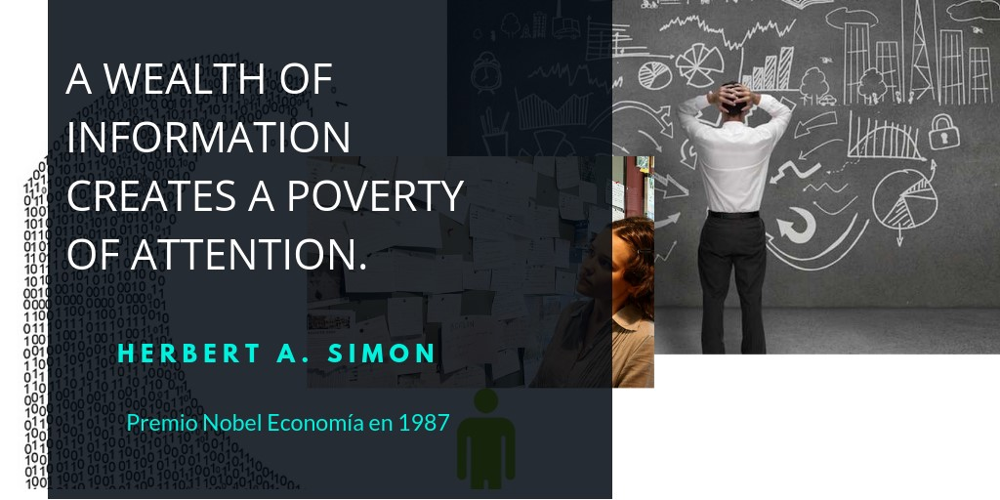</img></a>

---

## 2. Tecnología de información es 

> ### <i class="rojito fa fa-quote-left"></i>... la infraestructura que hace posible almacenar, buscar, acceder, copiar, filtrar, manipular, transmitir y recibir información</blockquote>

- La TI ha traído enormes incrementos en la capacidad para gestionar la información haciéndola más valiosa.
- El contenido no puede operar sin infraestructura y viceversa

.pull-left[    
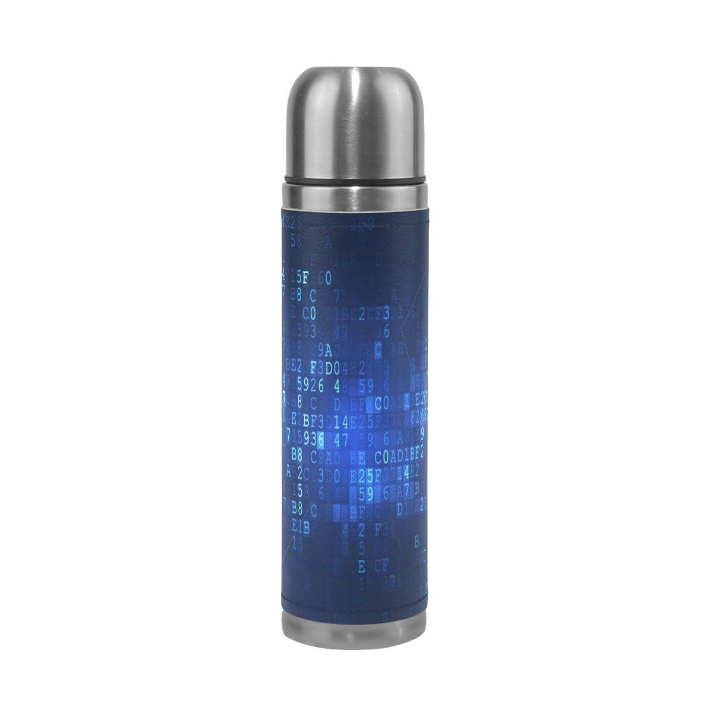</img>
]
.pull-right[
 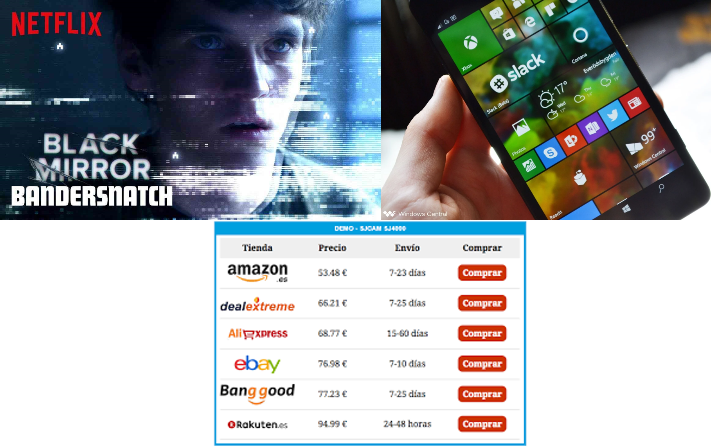</img>]

---
class: middle, center

## Breve historia de la IT
<iframe width="560" height="315" src="https://www.youtube.com/embed/pYjyqYi2J9I" frameborder="0" gesture="media" allow="encrypted-media" allowfullscreen></iframe>

<br><small><a href="https://www.youtube.com/watch?v=pYjyqYi2J9I" target="_blank">Fuente del video: GMB inc</a></small><br>
<a href="https://b.socrative.com/teacher/#live-results/table">Socrative Room: 282228</a>

---
class:middle

# Componentes en el Sistema de Información

### <span class="rojito">1.</span> Personas

### <span class="rojito">2.</span> Actividades o técnicas de trabajo

### <span class="rojito">3.</span> Datos

### <span class="rojito">4.</span> Recursos materiales en general (recursos informáticos y de comunicación, generalmente, aunque no necesariamente)

---
class:inverso, center, middle

# 2.- El papel de los Sistemas de Información en los negocios


---

# <span style="font-size:0.5em">2.1. Principales tendencias TIC a nivel mundial en 2017-2018</span>

<table class="tablabase">
<tr>
<th width="34%">Negocios</th>
<th width="33%">Tecnología</th>
<th width="33%">Sociedad</th>
</tr>

<tr>
<td valign="top">
<ul>

<li>Online retailing ↑ 20%</li>
<li>Mobile retailing ↑80.000M€ EU5*</li>
<li>Apps móviles 2000M usuarios</li>
<li>Comercio en RRSS ↑ 25.000M€ 2016</li>
<li>Plataformas de "servicio a demanda"</li>
<li>Publicidad móvil: 70% publicidad digital</li>
<li>Pequeños negocios: plataformas de comercio</li>

</ul>

</td>
<td  valign="top">

<ul>

<li>Capacidades móviles</li>
<li>Computación en la nube</li>
<li>Internet of Things</li>
<li>Big Data</li>
<li>Business Analytics</li>

</ul>

</td>

<td  valign="top">

<ul>

<li>Contenidos generados por los usuarios</li>
<li>Amenazas a la privacidad</li>
<li>Adultos en redes sociales</li>
<li>Conflictos de copyright</li>
<li>Aspectos tributarios</li>
<li>Seguridad de la red</li>
<li>Empleo precario</li>

</ul>

</td>

</tr>
</table>

<span style="font-size:0.7em"><i>Fuente: Laudon y Guercier (2018)</i><span>
.footnote[<span style="font-size:0.7em">* Francia, Alemania, Italia, España, Reino Unido</span>]

---

# 2.2. Evolución del Sector TIC en España

```{r echo=FALSE, fig.fullwidth=TRUE, message=FALSE, warning=FALSE, out.width="100%"}

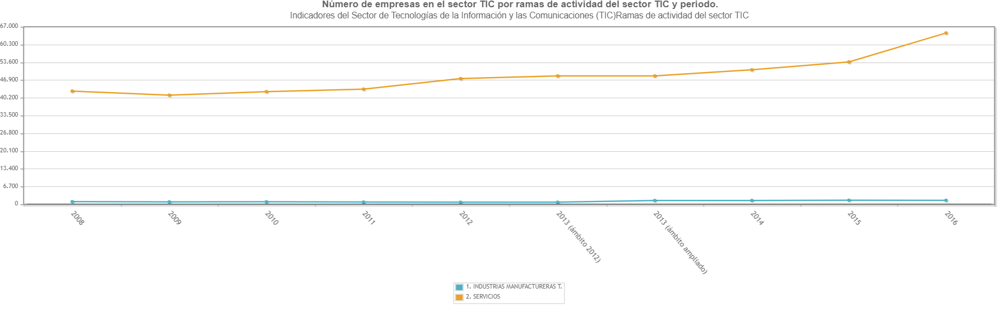

```

---

## Evolución por sectores

```{r echo=FALSE, fig.margin=TRUE, message=FALSE, warning=FALSE, out.width="100%"}

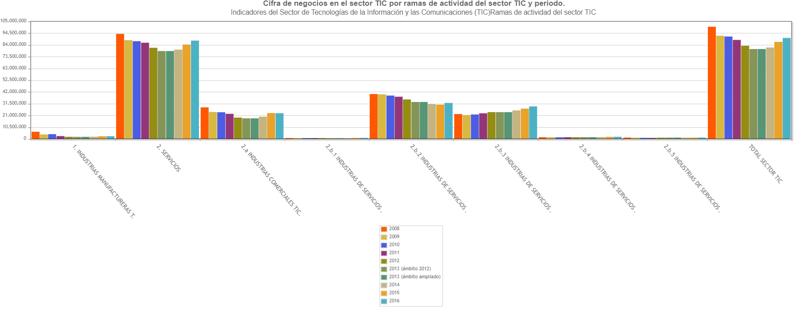

```
---

## Estimación de la Inversión en EEUU

### Inversión en Capital de Tecnología de la Información definida como Hardware, software y equipos de comunicaciones

```{r echo=FALSE, fig.margin=TRUE, message=FALSE, warning=FALSE, out.width="100%"}

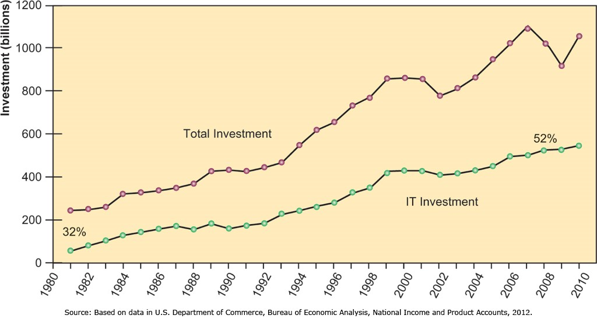

```

---
class: middle, center

# 2.3. Impacto en la estrategia corporativa

```{r echo=FALSE, message=FALSE, warning=FALSE, out.width="80%"}

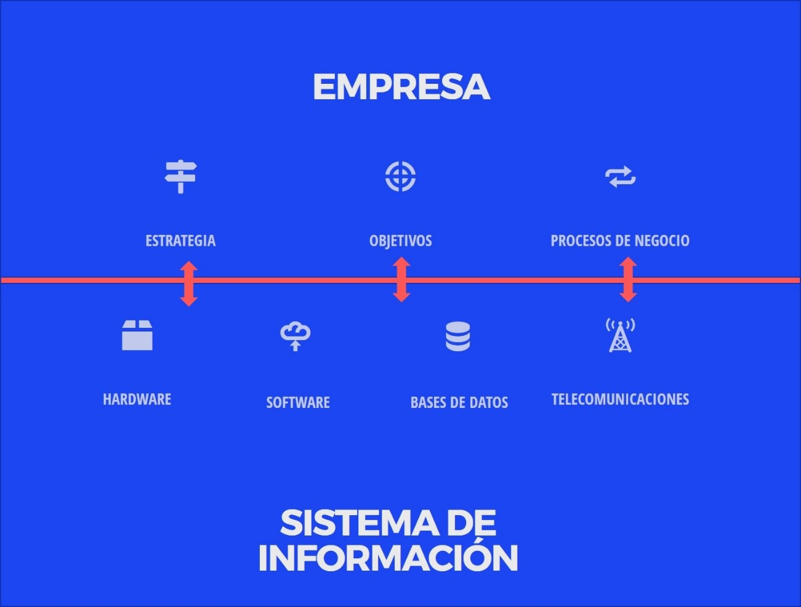

```

---
class: left, middle

<table class="tablabase">
  <tr>
    <th><span style="font-size:1.5">Posibles objetivos estratégicos y su relación con SI</span></th>
  </tr>
  <tr>
    <td>(a) Excelencia Operacional</td>
  </tr>
  <tr>
    <td>(b) Nuevos productos,servicios y modelos de negocio</td>
  </tr>
  <tr>
    <td>(c) Cercanía / compromiso con clientes y proveedores</td>
  </tr>
  <tr>
    <td>(d) Mejora en la toma de decisiones</td>
  </tr>
  <tr>
    <td>(e) Ventaja competitiva</td>
  </tr>
  <tr>
    <td>(f) Supervivencia</td>
  </tr>
</table>
---

## (a) Excelencia Operacional

> ### Mejora de la eficiencia de sus operaciones para alcanzar una mayor rentabilidad

.pull-left[**Impacto del SI**: Herramienta de mejora de eficiencia y productividad

Ejemplo: [Walmart Retail Link](http://www.retailcustomerexperience.com/blogs/walmarts-secret-sauce-how-the-largest-survives-and-thrives/)]

.pull-right[
```{r echo=FALSE, message=FALSE, warning=FALSE, out.width="100%"}

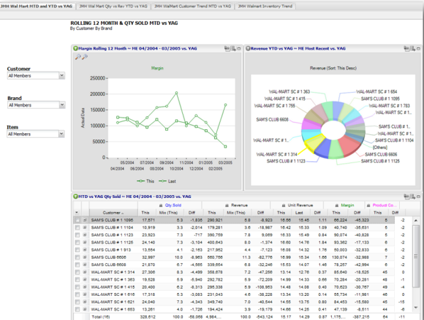

```
]

---

## (b) Nuevos productos,servicios y modelos de negocio

> ### Modelos de negocio: la forma en que una empresa produce, entrega y vende un producto o servicio para crear riqueza

.pull-left[**Impacto del SI**: Generan productos y servicios así como modelos de negocio totalmente nuevos]

.pull-right[<iframe width="360" height="315" src="https://www.youtube.com/embed/xEak6SDzc3A" frameborder="0" allow="accelerometer; autoplay; encrypted-media; gyroscope; picture-in-picture" allowfullscreen></iframe>]

---

## (c) Cercanía y compromiso con clientes y proveedores

> ### CRM: Customer Relationship Management: Cuando una empresa conoce a sus clientes y les da buen servicio, estos por lo general responden con fidelidad y comprando más, generando ingresos y ganancias

.pull-left[**Impacto del SI**: Requisito para poder implantar cualquier programa CRM. Sin un SI no podemos conocer, ni almacenar las interacciones con el cliente y no podemos personalizar la oferta.

- [Kiskos en Caprabo](http://www.gdpy.com.py/clientes-fidelizacion-digital/caso-de-exito-caprabo/) 
- [Amazon Web Services](https://www.xataka.com/otros/el-mercader-turco-en-internet-cambia-el-precio-en-cuanto-te-reconoce)]

.pull-right[

```{r echo=FALSE, fig.margin=TRUE, message=FALSE, warning=FALSE, out.width="80%"}


```

]

---

## (d) Mejora en la toma de decisiones

> ### Ante posibles situaciones de falta de información: Sobreproducción o subproducción, mala asignación de los recursos, tiempos de respuesta deficientes, mayores costes y pérdida de clientes

.pull-left[El Corte Inglés y SAP:

- ¿Qué es una solución estandarizada?  
- ¿Cuál es el foco de la actividad de El Corte Inglés?  
- ¿Cuáles son los retos futuros en retaling?  ]

.pull-right[

<iframe width="560" height="315" src="https://www.youtube.com/embed/UnpZt6fcD5o" frameborder="0" allow="accelerometer; autoplay; encrypted-media; gyroscope; picture-in-picture" allowfullscreen></iframe>
]

---
class: middle

## (e) Ventaja Competitiva

> ### Capacidad de la empresa para ser superior a la competencia de manera única y sostenible en el tiempo

Los sistemas de información proporcionan algunas de estas ventajas.

- Ejemplos: [Informe Interbrand: mejores marcas globales](https://www.interbrand.com/best-brands/best-global-brands/2018/ranking/)


---
class: middle

## (f) Supervivencia

> ### Determinados cambios en los mercados conllevan la necesidad de adaptación tecnológica para poder sobrevivir, no son una opción, son una necesidad.

Los sistemas de información permiten adaptarse a las nuevas realidades del mercado lo antes posible para que la empresa no quiebre.


```{r echo=FALSE, message=FALSE, warning=FALSE, out.width="60%"}

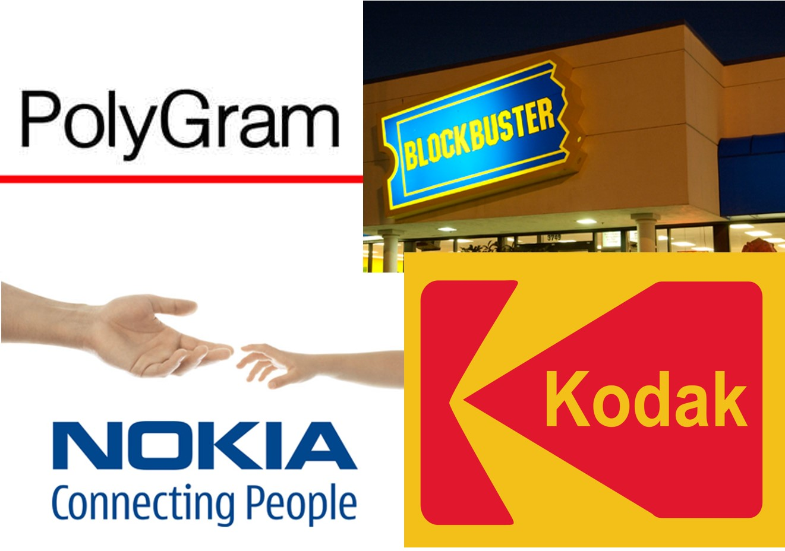

```

---
class:inverso, center, middle

# 3.- Los SI: Perspectiva tecnológica y de negocio


---

class: center, middle

## Perspectivas para analizar los Sistemas de Información

### Los SI se pueden analizar desde una perspectiva teconológica o desde un perspectiva de empresa

---

class:inverso, center, middle

# 3.1 Perspectiva tecnológica


---

## Perspectiva tecnológica (I): Datos vs Información: 

### - **Datos**: flujos de elementos en bruto, eventos
### - **Información**: datos transformados en elementos significativos y útiles

```{r echo=FALSE, message=FALSE, warning=FALSE, out.width="100%"}

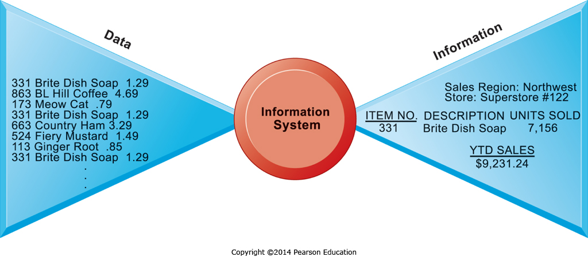

```

---

## Diferencia entre datos e información. Ejemplo Walmart

> Through Retail Link, Walmart essentially gives suppliers all of their sell through data by SKU, by hour, by store. They also give vendors on-hand inventory by SKU, as well as gross margin achieved, inventory turns, in-stock %, and yes, the metric of GMROII! Essentially, Walmart has created a vendor managed inventory system where they let you the supplier decide where to put SKUs and how to ship through to stores. 

<small>[Walmart Retail Link](http://www.retailcustomerexperience.com/blogs/walmarts-secret-sauce-how-the-largest-survives-and-thrives/)</small>

### ¿Qué son datos y qué es información?

---

## Perspectiva tecnológica (II): ¿Cómo se produce la información?

- Actividades en un Sistema de Información: 

  - **Input**: Captura de datos de la organización o el entorno  
  - **Procesamiento**: Implantan programas y planes de gerencia  
  - **Output**: Transferencia de la información a las actividades o personas necesarias  
  - Además, el **feedback**: es la información que se devuelve para evaluar y refinar la entrada  

---

## Perspectiva tecnológica (III): Representación gráfica

```{r echo=FALSE, message=FALSE, warning=FALSE, out.width="100%"}

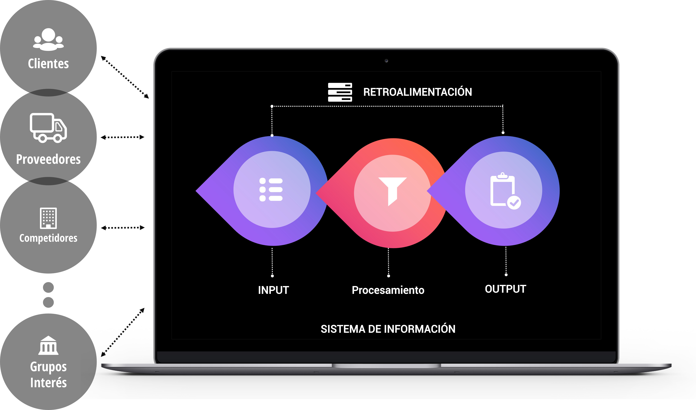

```

---

## Perspectiva tecnológica (IV). Componentes a tener en cuenta

Para implantar o analizar un SI es necesario tener en cuenta tres componentes:

### 1.- Organización
### 2.- Administración
### 3.- Tecnología

---
## Perspectiva tecnológica (V): Organización

.pull-left[

### ¿Cómo es su jerarquía de autoridad y responsabilidad? :

```{r echo=FALSE, message=FALSE, warning=FALSE, out.width="100%"}

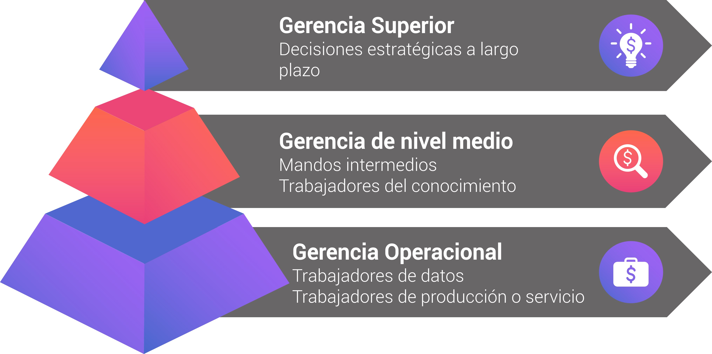

```

]

.pull-right[

### ¿Cómo está organizado el negocio?:

- Funciones
- Procesos
- Cultura organizativa
]

---

## Perspectiva tecnológica (VI): Administración

### - ¿Qué **objetivos y estrategia** tienen los administradores de la organización?
### - El SI estará condicionado por estos objetivos y el **estilo de liderazgo**
### - El nuevo conocimiento puede generar **cambios** que debe impulsar la administración

---

## Perspectiva tecnológica (VII): Tecnología

.pull-left[
### - Hardware y software
### - Tecnologías de Gestión y Manejo de Datos
### - Redes y tecnologías de la telecomunicación: Intranets, extranets, Internet
### - Infraestructura de IT
]

.pull-right[
```{r echo=FALSE, message=FALSE, warning=FALSE, out.width="100%"}


```

]
---
class:inverso, center, middle

# 3.2 Perspectiva de negocio

---

class: center, left

## Perspectiva empresarial (I)

### Los SI son instrumentos de **creación de valor**

### Las inversiones en tecnología deben proporcionar:

- <i class="rojito fa fa-caret-up"></i> productividad  

- <i class="rojito fa fa-caret-up"></i>  ingresos  

- <i class="rojito fa fa-caret-up"></i> posición estratégica  

- ...

### Como hemos señalado, deben contribuir a los objetivos de la empresa


---
class: center, middle

## Perspectiva empresarial (II)

### **Ejemplo:** <a href="https://www.youtube.com/watch?v=y5B5GLMv97s" target="_blank">Innovación</a><br>

<iframe width="560" height="315" src="https://www.youtube.com/embed/y5B5GLMv97s" frameborder="0" gesture="media" allow="encrypted-media" allowfullscreen></iframe>
                    
¿qué aporta a la empresa?

---

class: center, left

## Perspectiva empresarial (III):  La Cadena de Valor de la Información en los negocios

### Los datos en bruto adquiridos y transformados a través de etapas generan **información de valor** 

### El **valor** del SI se determina por el grado en que se alcanzan **mejores decisiones, una mayor eficiencia y mayores beneficios**

---

## Perspectiva empresarial (V): ¿Garantiza el éxito la inversión en tecnología de información?

```{r echo=FALSE, message=FALSE, warning=FALSE, out.width="90%"}

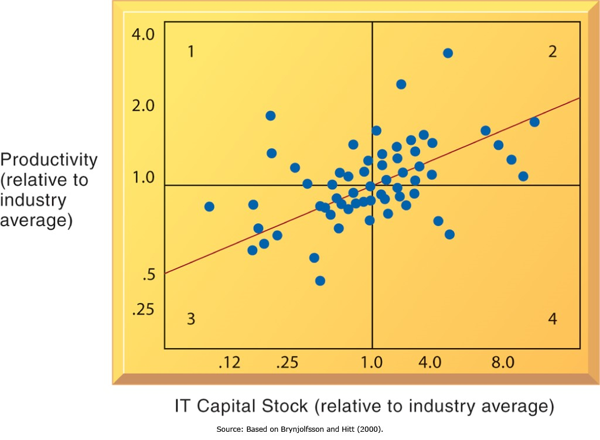

```

Fuente: Laudon &amp; Laudon, (2014) Management Information Systems: Managing the Digital Firm, 12th Edition


---

class: center, left

## Perspectiva empresarial (V): ¿Qué factores contribuyen al éxito?

### Existencia de **activos complementarios**: características de la organización, de su gestión o del entorno que aumentan el valor de la inversión primaria

---

class:inverso, center, middle

# 4.- Los SI: Perspectiva en este curso

---

## Qué perspectiva vamos a seguir?

.pull-left[

### En este curso se combinan la perspectiva tecnológica, la de empresa y otros enfoques en una perspectiva **socio-técnica**

### Desempeño organizacional óptimo logrado mediante la optimización conjunta de sistemas sociales y técnicos utilizados en la producción]

.pull-right[

```{r echo=FALSE,  message=FALSE, warning=FALSE, out.width="100%"}

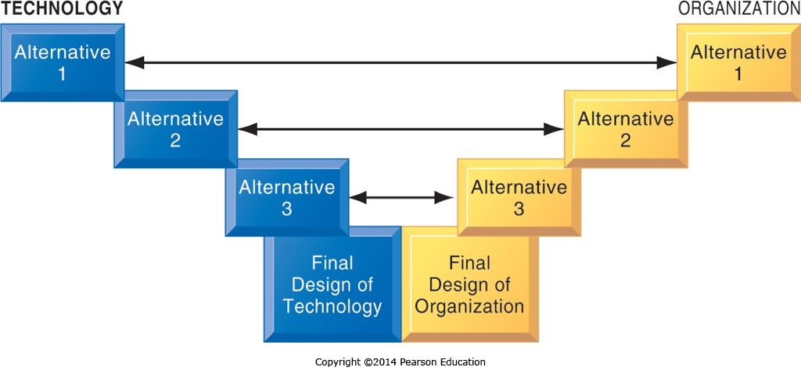

```
]

---

### Representación gráfica: Integración de los enfoques


```{r echo=FALSE,  message=FALSE, warning=FALSE, out.width="100%"}

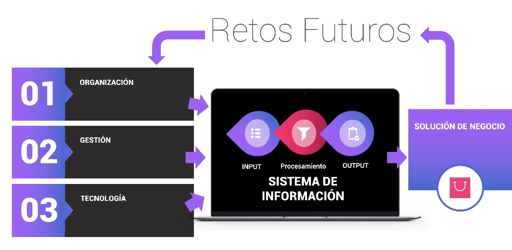

```

---
### Ejemplo Aplicación

```{r echo=FALSE,  message=FALSE, warning=FALSE, out.width="100%"}

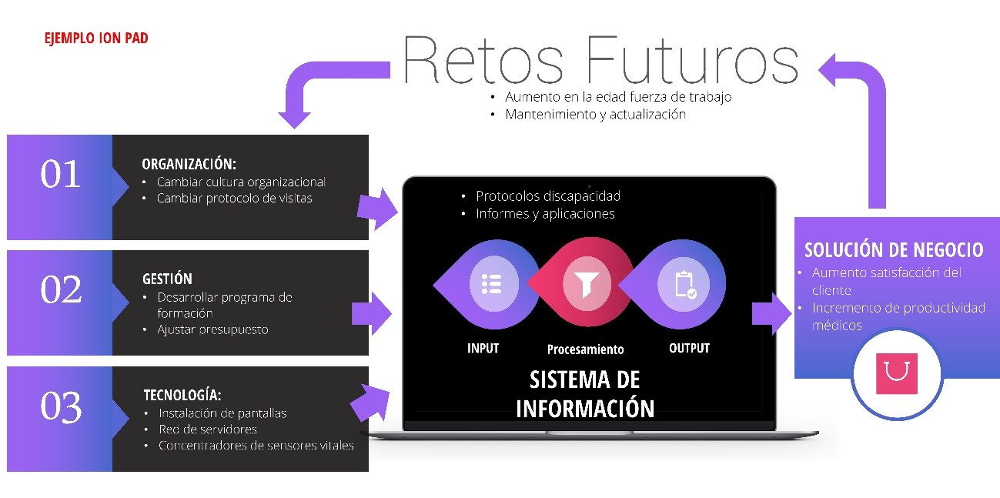

```
